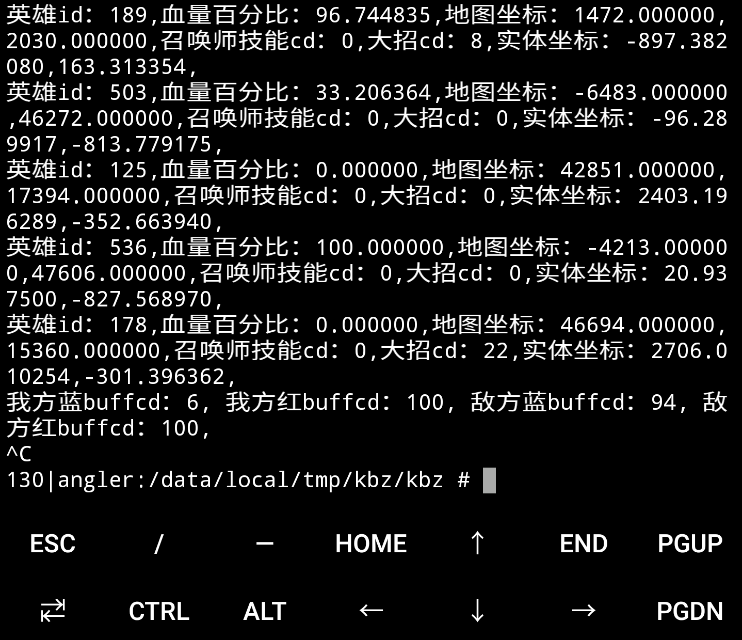

# *仅限研究使用，禁止用作非法用途，非法使用造成的一切后果自行承担

## termux 编译 

```bash
pkg install clang termux-elf-cleaner
clang kk.cpp -o kk -lstdc++ -pthread
strip -s kk
strip -R .comment kk
termux-elf-cleaner kk
```

注意：如果直接使用 termux 编译那你删掉了 termux 那就无法运行了，除非想办法静态链接。 

## 建议使用 aarch64 alpine clang编译，优点依赖少性能好文件小

```ash
apk add musl-dev clang gcc g++
clang kk.cpp -o kk -lstdc++ -static
strip -s kk
strip -R .comment kk
```

PS：可以使用 termux 或 linuxdeploy 安装 alpine 

c4droid 不支持 clang 但是可以编译，不过不推荐

交叉编译...

## 测试

打开一局游戏，匹配排位自定义，进入游戏后打开终端运行本程序。

英雄对应id参考 http://www.87g.com/wzry/63929.html

buffcd时间是倒计时，100代表已经冷却好了




有什么问题可以发邮件 kekelanact@gmail.com
